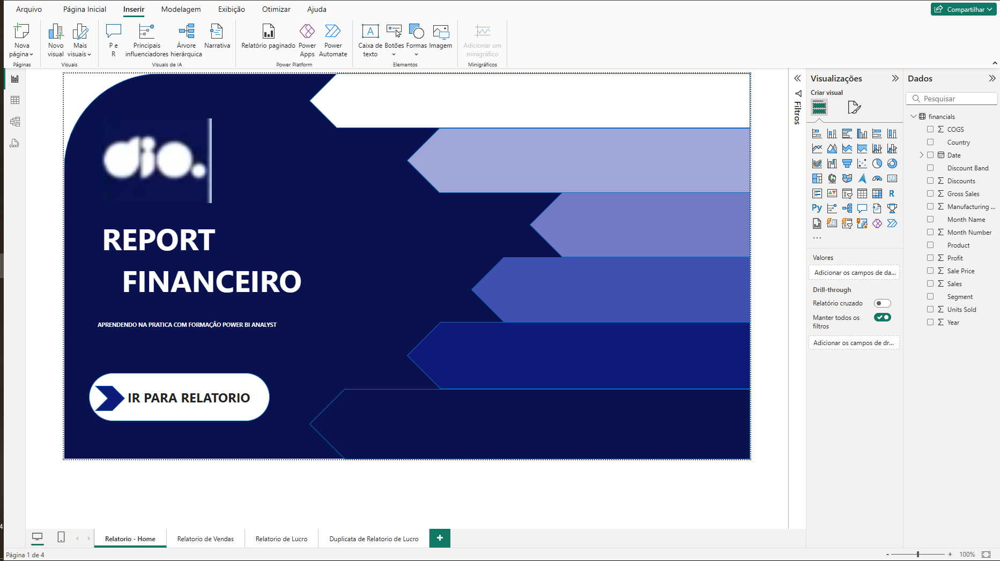
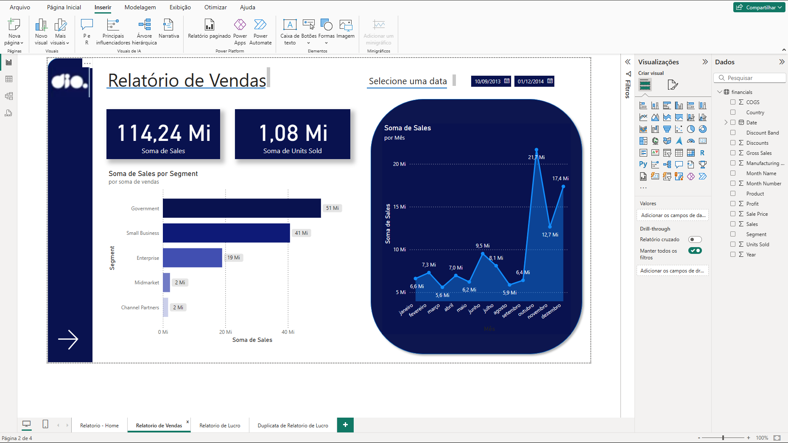
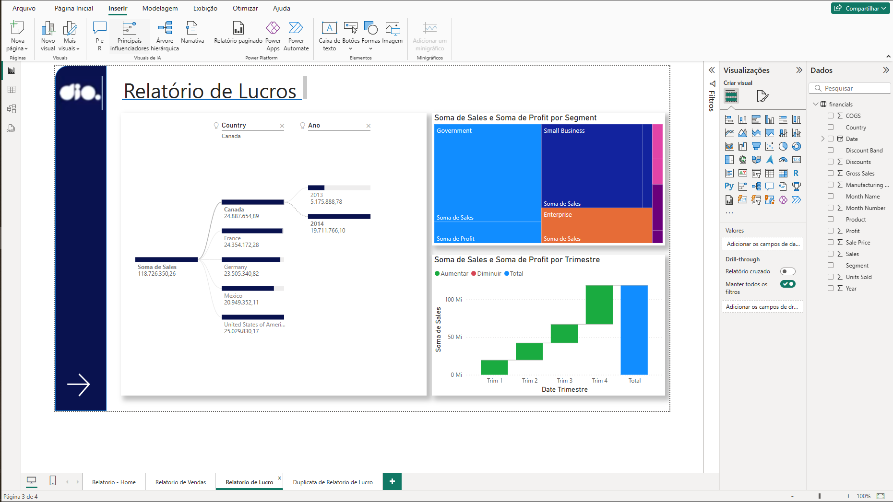
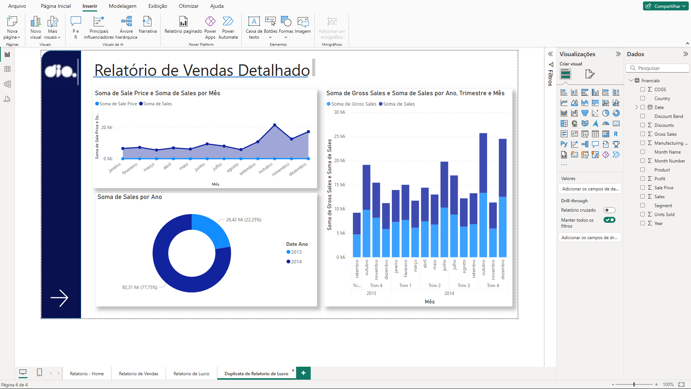

# Desafio Relatorio DataAnalyst

'Aqui adicionarei a resolução do Desafio proposto pela instrutora da DIO.'

Projeto de Data Analytics com Power BI

### Pontos a serem considerados

· Crie a página detalhes conforme mostrado no desafio de projeto

· Pense na disposição dos visuais em como o cliente irá consumir o conteúdo

· Dependendo da disposição dos visuais o número de páginas pode variar. Até duas páginas podem compor o que é pedido

· Crie as medidas necessárias

### Visuais que podem compor o relatório:

· Visuais sobre os TOP3 Produtos

· Principais países em termos de vendas e/ou profit (ou outro campo)

· Gráfico de dispersão sobre Unidades vendidas e Vendas por mês

· Visuais de agrupamentos de dados

· Visuais de compartimentação dos dados

# Resolução do Desafio:

